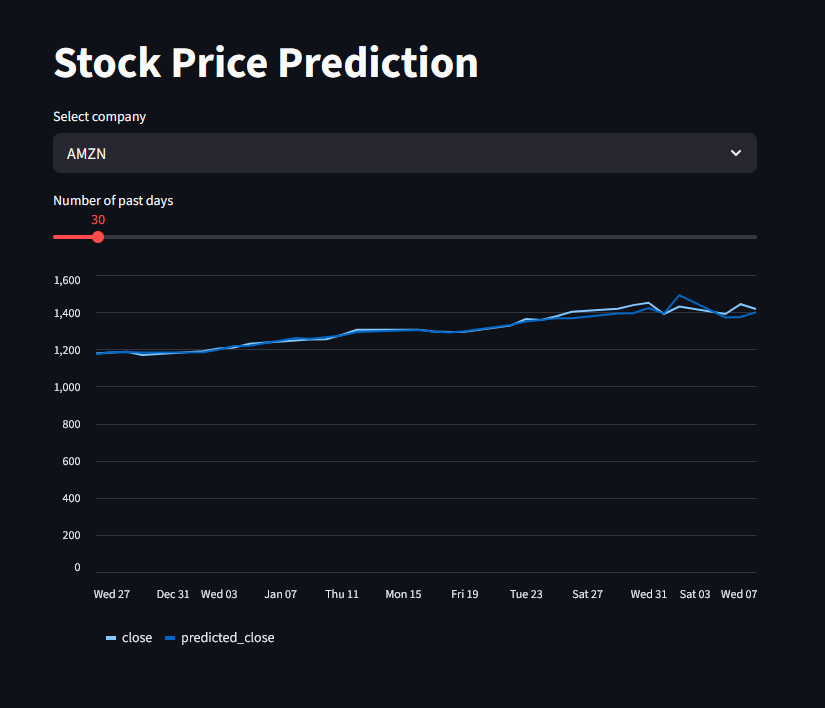

# CSIS4260 Assignment 1

**Github Repository Link:** https://github.com/mikeverwer/4260Ass1

## Creating the Environment

To activate the environment run the command(s) described based on your python installation (ie: base Python or Conda/Miniconda)

### **Python**

  ```
    python -m venv venv
    pip install -r requirements.txt
  ```

### **Conda/Miniconda**

  ```
    conda env create -f env.yaml
  ```

## Part 1

The file `part1.py` contains the code that will expand the base `all_stocks_5yr.csv` file to 10x and 100x sizes in both `.csv` and `.parquet` formats. The code compares file size and read/write time for both file formats. The file can be run standalone, but the benchmark outputs are shown below.

The csv file format is consitently faster to read across all file sizes tested, but parquet files are at minimum 3x smaller and typically write around 10x faster. At the base file size, the difference in terms of percentages are significant, but the actual deltas are quite small. Therefore, I will be using the csv format for the rest of the assignment.

### Benchmarks
```
Base CSV: 619,040 rows, 103.4 MB

=== Creating 1x scale ===
Created 619,040 rows: 0.00s
  Memory: 103.4 MB
  CSV write: 2.03s (30.2 MB)
  Parquet write: 0.30s (10.5 MB)
  CSV/Parquet size ratio: 2.9x

Read benchmarks:
  Pandas CSV (10k rows): 0.016s
  Pandas Parquet (10k): 0.104s

=== Creating 10x scale ===
Created 6,190,400 rows: 0.06s
  Memory: 1034.4 MB
  CSV write: 20.40s (302.0 MB)
  Parquet write: 2.60s (99.5 MB)
  CSV/Parquet size ratio: 3.0x

Read benchmarks:
  Pandas CSV (10k rows): 0.016s
  Pandas Parquet (10k): 0.556s

=== Creating 100x scale ===
Created 61,904,000 rows: 0.62s
  Memory: 10344.4 MB
  CSV write: 203.71s (3020.0 MB)
  Parquet write: 26.02s (994.1 MB)
  CSV/Parquet size ratio: 3.0x

Read benchmarks:
  Pandas CSV (10k rows): 0.016s
  Pandas Parquet (10k): 5.361s
```

## Part 2

Refer to `Part2.pdf`, or `part2.ipynb` for full details on the implementation of part 2.

Since the base file has fewer than 1 million rows, the difference in performance between pandas and polars was minimal &ndash; and surprisingly pandas outperformed polars.

## Part 3

I chose to use Streamlit to build the dashboard due to its simplicity and ease of use. The code to produce the dashboard is contained in `part3.py`. To run the file use the following command in either a bash or command prompt terminal:

```bash
streamlit run part3.py
```


